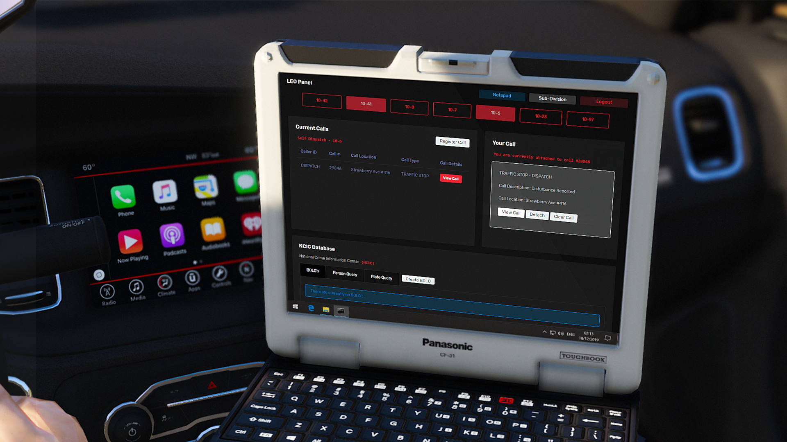
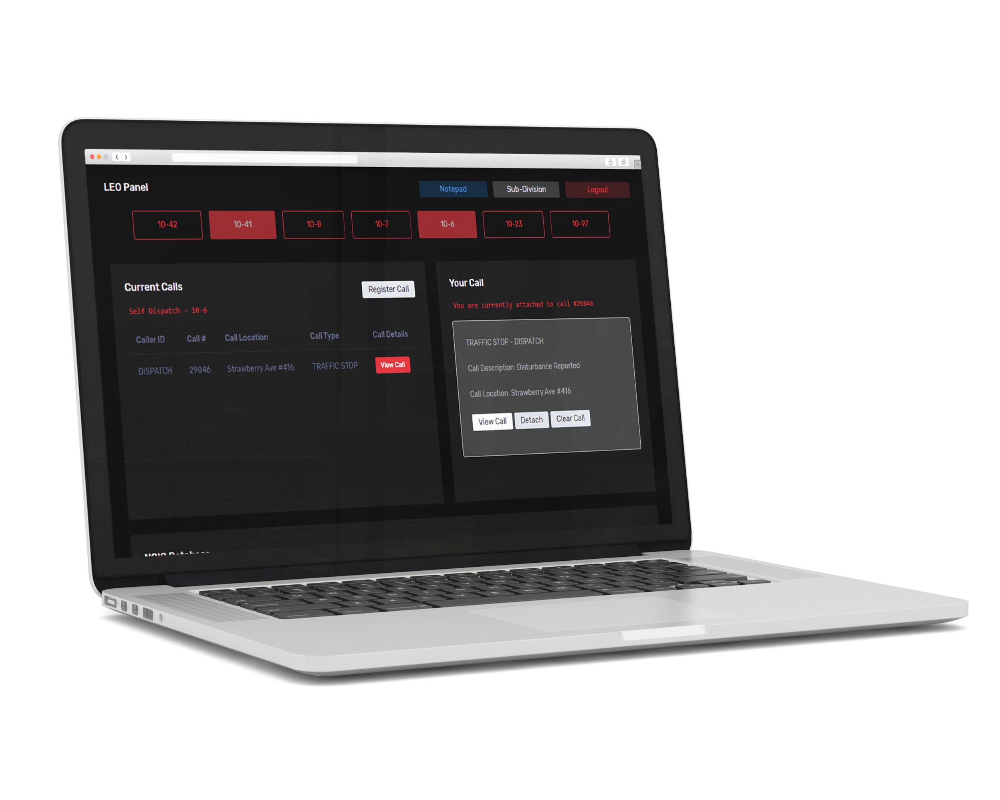
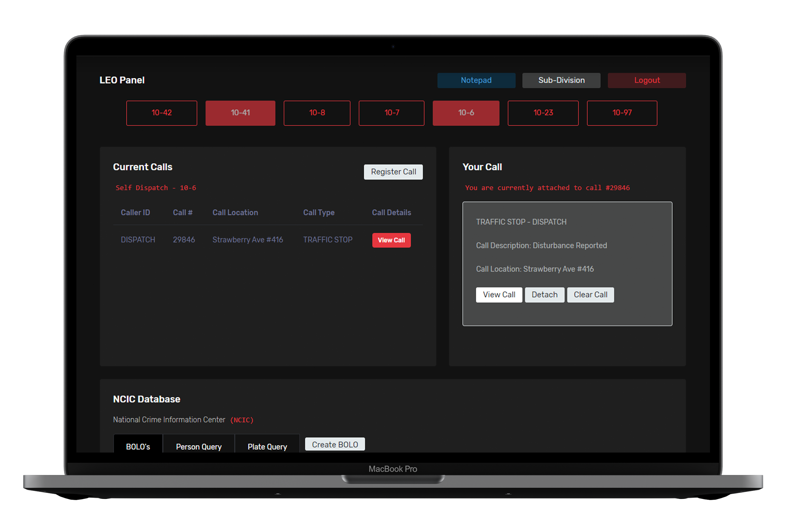

# Tommy's CAD/MDT System

## Overview

 An open-source Computer-Aided Dispatch (CAD) and Mobile Data Terminal (MDT) system designed for use in the FiveM platform. This system is released under the GNU General Public License, ensuring that it remains open and accessible to the community.

## Features

- **Civilian Panel:** Manage civilian data and interactions.
- **LEO Panel:** Law Enforcement Officers can access essential tools and information.
- **Subdivisions:** Organize and manage subdivisions efficiently.
- **Fire/EMS Panel:** Provide tools and information for Fire and EMS personnel.
- **Dispatch Panel:** Facilitate dispatch operations with dedicated tools.
- **Dispatch Mode:** Enables a specialized dispatching mode for enhanced control.
- **Live Map:** Real-time mapping integration for better situational awareness.
- **Steam Integration:** Seamlessly integrate with Steam for user authentication.
- **In-game Integration:** Utilize [MDT Integration](https://git.tommy-johnston.com/tommy/mdt-integration) for enhanced in-game features.

## Screenshots and Videos

### Teaser Video
<video width="1280" height="720" controls>
  <source src="https://git.tommy-johnston.com/tommy/CAD-MDT/media/branch/main/teaser-vid.mp4" type="video/mp4">
</video>

### Trailer Video
<video width="1280" height="720" controls>
  <source src="https://git.tommy-johnston.com/tommy/CAD-MDT/media/branch/main/trailer-vid.mp4" type="video/mp4">
</video>

## Installation

1. Clone the repository: `git clone https://git.tommy-johnston.com/tommy/CAD-MDT.git`
2. Import the `release.sql` file into your database and configure the `config.php` file.
3. Host all of the files on an nginx or apache server.

## License

This project is licensed under the GNU General Public License - see the [LICENSE](LICENSE) file for details.